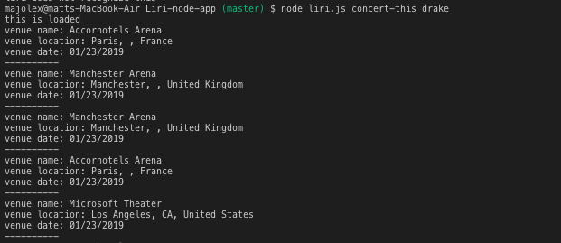
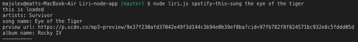
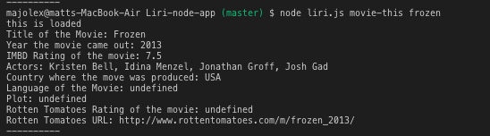
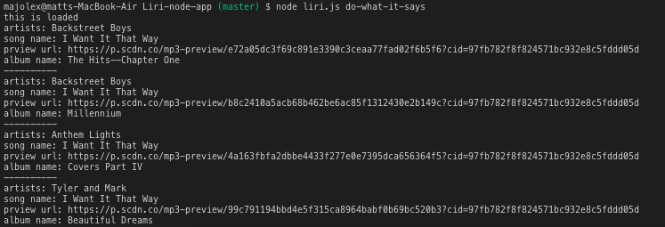

# Liri-node-app

## LIRI is a Language Interpretation and Recognition Interface. Use LIRI to find out about a song, or a movie, bands or just choose a random action from your own random file.

# Installs
## The package.json lists dependent node packages, but for your convenvice, these are the ones to install.

# Bands in Town 
## npm install axios

# Spotify
## npm install spotify

# Request
## npm install request

# FS
## npm install fs

# Get Started
## Here's a quick rundom of the commands you can use in LIRI.

# Get Concerts
## Find concerts neer you concert-this 

# Get Song Info
## Retrieves song information for a track:

## node liri.js spotify-this-song "The eye of the tiger"

# Get Movie Info
## Retrieves movie information for a movie:

## node liri.js movie-this "Frozen"

## Get Random Info
## Gets random text inside a file and does what it says:

# node liri.js  do-what-it-says
